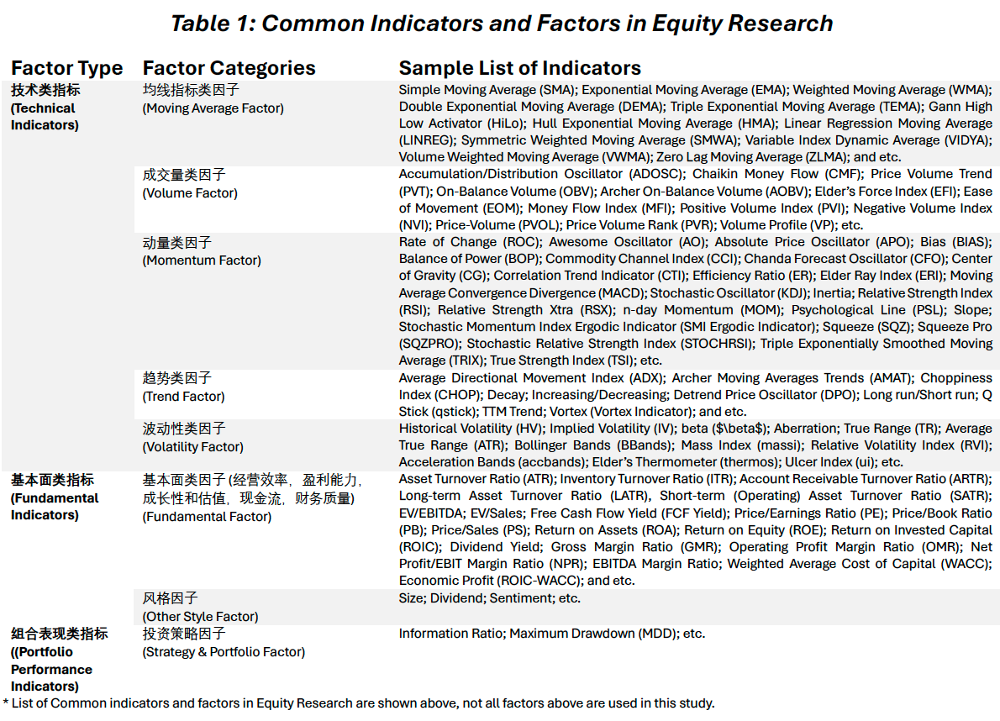

<span style="color:red;font-weight:700;font-size:32px">Base Stock Selection Strategy Using Quantitative Models 量化选股策略模型</span>  

<span style="color:red;font-weight:700;font-size:24px">The Base Model: a Technical Signaling Tool for Stock Selection 基础模型：技术指标选股工具</span>  

# Investment Strategy Outlook 投资策略及模型规划

## Research Objectives 研究目标

For the purpose in discovering the potential U.S. equity investment opportunities, we are attempting to utilize a quantitative methodology based on a programming approach which adapts a price/volume or trend trading strategy by constructing a model using a combination of objective evaluation criteria, technical indicators, and fundamental factors.

翻译

## Considerations on Investment Strategy 投资策略的思考

The major investment goals are:

* Construct a stock-only portfolio with (appropriate) maximized expected upside returns in the long-run;

* Construct the portfolio such overall and continuous downside risks are minimized.

$\Rightarrow$ Investment Goal: Construct a (stock-only) portfolio with maximum long-term risk-adjusted returns while controlling the drawdown proactively.

翻译

In order to select a pool of U.S. stocks (from the major U.S. Indexes) which are in consistent with the preset investment goals & risk preferences, we consider the following trading perspectives:

* In the world of trading, signals are **indicators** which are derived from various continuously changing statistics and variables, and guide the investors on trading directions (buy, sell, and hold).

* Such signals or indicators help the traders and PMs becoming more informed and aware of the current market performance/conditions.

翻译

There are two major approaches to classify the indicators or to analyze any asset, i.e. technical analysis & fundamental analysis:

* **Fundamental analysis** focuses on the performance of an asset by studying various factors/indicators, which may impact the asset price, such as the company's earnings, its cash flow statement and balance sheet, operating efficiency, corporate governance, sector outlook, macro trend, and etc.

* Unlike the income statement modeling and industry/sector research conducted by the fundamental analysis, **technical analysis** aims to predict the future movements(patterns and trends) of certain indicators of an asset (mostly price and volume related); based soley on the historical/past characteristics of various technical indicators, which are (typically) displayed graphically in charts.

翻译

The core assumptions behind these two major methods are that:

(1) The fundamental analysis approach uses information (directly or indirectly) related to the asset itself (e.g EBITDA of the firm), and assumes those information were already factored into the market price fluctuations in time (the EMH).
    By identifying the historical patterns of these indicators or factors, and assuming they provide sufficient information in predicting the (future) trend, one can predict such indicator for the near future (e.g FY26E \$EPS).
    Further, utilizing modern finance models like the CAPM and the multi-factor models with Machine Learning, future asset price movements can be predicted with more confidence (however, not necessarily accuracy).

(2) the assumptions for the technical analysis approach are much simpler.
    One believes that the historical up/down trend of a technical indicator will continue on that path or the path will reverse in the near-term future.
    In other words, technical indicators like price and trading volume, are assumed to move in trends or counter trends, which are repetitive, with certain patterns reoccurring, i.e.
    History will repeat itself (Example: momentum trading strategy and mean reversion strategy).

翻译

With the research goal in building a portfolio with maximum long-term risk-adjusted returns while controlling the maximum drawdown, we certainly need to invest in a pool stocks with the largest winning probability in gaining positive investment returns and with the least amount of volatility.

By acknowledging the usefulness and limitations of fundamental and technical analysis, we can design a quantitative model based on these analytically methodologies to build a portfolio which best suit our preset investment goals and risk preferences.

翻译  

```{r eval=FALSE, message=FALSE, warning=FALSE, include=FALSE}
# Clean the environment
rm(list = ls())
```

```{r message=FALSE, warning=FALSE, include=FALSE}
### Load packages
library(tsibble)
library(lubridate)
library(tidyverse)
library(quantmod)
library(rvest) 
library(xts)
library(TTR)
library(blotter)
library(rvest)
library(quantstrat)
library(zoo)
library(knitr)
library(kableExtra)
library(readxl)
library(plotly)
# nasdaq api 44D9F6_XzqEy8xstEuxb
```

```{r echo=FALSE, message=FALSE, warning=FALSE, fig.pos='H'}
FactorType = c(rep("技术类指标(Technical Indicators)",5),"基本面类指标(Fundamental Indicators)","基本面类指标(Fundamental Indicators)","组合表现类指标((Portfolio Performance Indicators)")

FactorCategories = c("均线指标类因子(Moving Average Factor)","成交量类因子(Volume Factor)","动量类因子
(Momentum Factor)","趋势类因子(Trend Factor)","波动性类因子(Volatility Factor)","基本面类因子(经营效率，盈利能力，成长性和估值，现金流，财务质量)(Fundamental Factor)","风格因子(Other Style Factor)","投资策略因子(Strategy & Portfolio Factor)") 

SampleListofIndicators = c("Simple Moving Average (SMA); Exponential Moving Average (EMA); Weighted Moving Average (WMA); Double Exponential Moving Average (DEMA); Triple Exponential Moving Average (TEMA); Gann High Low Activator (HiLo); Hull Exponential Moving Average (HMA); Linear Regression Moving Average (LINREG); Symmetric Weighted Moving Average (SMWA); Variable Index Dynamic Average (VIDYA); Volume Weighted Moving Average (VWMA); Zero Lag Moving Average (ZLMA); and etc.", "Accumulation/Distribution Oscillator (ADOSC); Chaikin Money Flow (CMF); Price Volume Trend (PVT); On-Balance Volume (OBV); Archer On-Balance Volume (AOBV); Elder’s Force Index (EFI); Ease of Movement (EOM); Money Flow Index (MFI); Positive Volume Index (PVI); Negative Volume Index (NVI); Price-Volume (PVOL); Price Volume Rank (PVR); Volume Profile (VP); etc.","Rate of Change (ROC); Awesome Oscillator (AO); Absolute Price Oscillator (APO); Bias (BIAS); Balance of Power (BOP); Commodity Channel Index (CCI); Chanda Forecast Oscillator (CFO); Center of Gravity (CG); Correlation Trend Indicator (CTI); Efficiency Ratio (ER); Elder Ray Index (ERI); Moving Average Convergence Divergence (MACD); Stochastic Oscillator (KDJ); Inertia; Relative Strength Index (RSI); Relative Strength Xtra (RSX); n-day Momentum (MOM); Psychological Line (PSL); Slope; Stochastic Momentum Index Ergodic Indicator (SMI Ergodic Indicator); Squeeze (SQZ); Squeeze Pro (SQZPRO); Stochastic Relative Strength Index (STOCHRSI); Triple Exponentially Smoothed Moving Average (TRIX); True Strength Index (TSI); etc.","Average Directional Movement Index (ADX); Archer Moving Averages Trends (AMAT); Choppiness Index (CHOP); Decay; Increasing/Decreasing; Detrend Price Oscillator (DPO); Long run/Short run; Q Stick (qstick); TTM Trend; Vortex (Vortex Indicator); and etc.","Historical Volatility (HV); Implied Volatility (IV); beta ($\beta$); Aberration; True Range (TR); Average True Range (ATR); Bollinger Bands (BBands); Mass Index (massi); Relative Volatility Index (RVI); Acceleration Bands (accbands); Elder’s Thermometer (thermos); Ulcer Index (ui); etc.","Asset Turnover Ratio (ATR); Inventory Turnover Ratio (ITR); Account Receivable Turnover Ratio (ARTR); Long-term Asset Turnover Ratio (LATR), Short-term (Operating) Asset Turnover Ratio (SATR); EV/EBITDA; EV/Sales; Free Cash Flow Yield (FCF Yield); Price/Earnings Ratio (PE); Price/Book Ratio (PB); Price/Sales (PS); Return on Assets (ROA); Return on Equity (ROE); Return on Invested Capital (ROIC); Dividend Yield; Gross Margin Ratio (GMR); Operating Profit Margin Ratio (OMR); Net Profit/EBIT Margin Ratio (NPR); EBITDA Margin Ratio; Weighted Average Cost of Capital (WACC); Economic Profit (ROIC-WACC); and etc.","Size; Dividend; Sentiment; etc.","Information Ratio; Maximum Drawdown (MDD); etc.")

allfactortable <- data.frame(FactorType,FactorCategories,SampleListofIndicators)

allfactortable <-allfactortable %>%
  rename("Factor Type" = FactorType,
         "Factor Categories" = FactorCategories,
         "Sample List of Indicators" = SampleListofIndicators)
```   

```{r}

```

```{r echo=FALSE, message=FALSE, warning=FALSE}

```


## Considerations on Model Designs 模型设计的思考

In achieving the ultimate investment goal of building a 'high-return and low-risk' stock-only portfolio, we are aiming to build a quantitative model with the most effective components.

There are countless relative metrics and factors evaluating an asset or a firm, whether the particular indicator/factor is **significant** to the price movements is a question in much more depth.

翻译

To have 'meaningful' model components, we will divide and concur the research objectives by first selecting stocks with near-term investment opportunities (the `base model`).
Following, we will then filter the selected list of stock more rigorously so the positive investment return are more 'certain' for the longer-term with minimal downside risk (the `full model`).

In other words, the `base model` will input the **significant** technical indicators to select a list of 'possible winning' U.S stocks (with potential investment opportunities).
Following, the `complete model` (*Section 5*) will include the **significant** fundamental indicators/factors to further filter from the list of selected stocks, and keep the ones with 'higher certainty' of long-term risk-adjusted (investment) returns.

翻译

Besides selecting stocks based on appropriate and significant indicators/factors with the greatest investment return potentials, the model will also include **subjective filters** to suit specific investment needs/goals (example: able to buy and hold, hot areas of investment interest), risk preferences, and compliance requirements (example: invest in market cap $>\$7B$)。

翻译 过滤条件是主观设定的，同时可以根据其他投资需求与风险偏好进行筛选。

A **technical indicator** is basically a mathematical representation and manipulation of the basic raw trading data and statistics of an asset (e.g. adj close price, trading volume, 52-week high and low, etc.).
In other words, a technical indicator is usually a derivation of the raw trading statistics and is designed to represent/signal certain market behavior.

* Traders typically view the technical indicators as tools on a trading chart to analyze the market trend in a clearer manner. In trading, a technical indicator is like a financial compass, which provides certain market behavior insights (overbought, oversold, potential reversal, range-bound, etc), so investment opportunities and risks can be identified more clearly and intuitively. Traders and PMs can utilize a combination of technical indicators to make informed real-time trading decisions with more confidence.

**here**

One of the ultimate goals in any type of security analysis is to understand/predict the ‘direction’ of the asset’s future price movements.
There are various technical indicators that traders use to predict/deduce future price levels (*Section 2.2*).

* One of the common technical trading strategies is momentum trading, which is also the core assumptions we made in building the stock selection model. A stock that has been rising is said to have positive momentum while a stock that has been crashing is said to have negative momentum. Momentum is an investing factor that aims to benefit from the ongoing trend of a stock or asset. 

* Momentum trading centers on buying and selling assets following their recent performance trends. Traders using this strategy believe that assets moving strongly in a direction will continue to do so. They aim to capitalize on this momentum before it fades.  

*Trend followers believe that stocks moving up or down will continue on that path.

In contrast, mean reversion suggests that assets overreact and will eventually return to their mean values.Momentum trading thrives in markets exhibiting strong trends.
It’s less effective in sideways or highly volatile markets.
Therefore, identifying the right market conditions is critical for success.
Sudden market reversals can quickly erode gains.
Hence, effective risk management is essential.

Technical Indicators do not follow a general pattern, meaning, they behave differently with every security.
What can be a good indicator for a particular security, might not hold the case for the other.
Thus, using a technical indicator requires jurisprudence coupled with good experience.